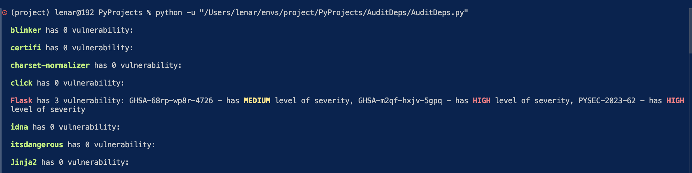
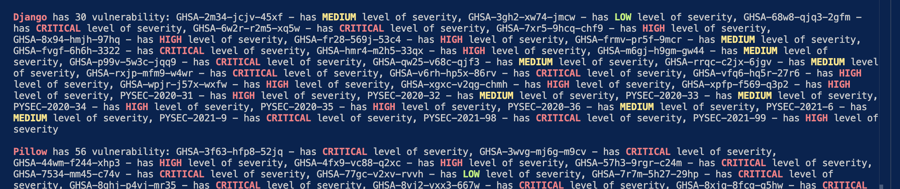
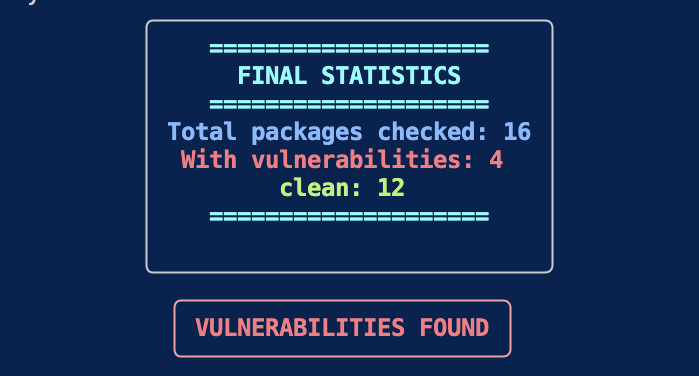

# AuditDeps
  

## DESCRIPTION

console utility for checking Python dependencies for known vulnerabilities with OSV API

## Features

* requirements.txt check
* result caching
* determination of the severity level 
    - CVSSV2
    - CVSSV3
    - CVSSV4
* output with Rich
* final statistic
* Exit code (CI/CD)

## Install

git clone https://github.com/m1cckey/AuditDeps.git
cd AuditDeps
pip install -r requirements.txt

## Using

AuditDeps/AuditDeps.py --requirements ./requirements.txt --cache ./cache.json -v(optional)

## screenshots

## Tech Stack

Python, Requests, Rich, OSV API, Requirements-parser, Json

## Step-by-Step work

Parse the file -> request to API -> Caches -> show statistics

## Author

M1cckey https://github.com/m1cckey
